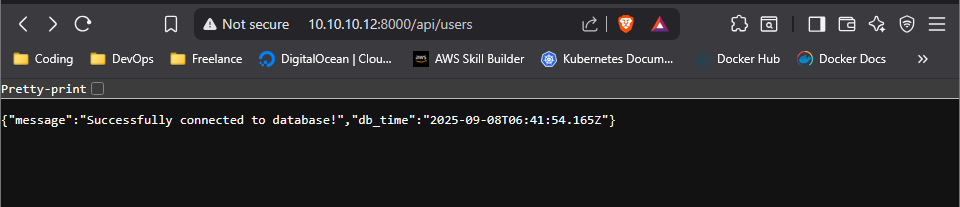

Mini project modul untuk mempelajari **Docker** dan **Docker Compose** dengan membuat sebuah lingkungan sederhana yang terdiri dari **API Service** dan **Database**, dihubungkan melalui custom network.

---

````markdown
# 🐳 microstack-docker-lab

---

## Cara Menjalankan project ini

1. Clone repo ini

   git clone https://github.com/MochamadAbdulRouf/microstack-docker-lab.git
   cd microstack-docker-lab


2. Jalankan container dengan Docker Compose

   ```bash
   docker compose up -d
   

3. Akses API service di browser atau menggunakan curl

   ```bash
   curl http://localhost:8080
  

4. Untuk mematikan container + network + volume

   ```bash
   docker compose down -v
 
````
---

# HASIL AKHIR TEST DI BROWSER


## 🎯 Tujuan

Project ini dibuat untuk tujuan **pembelajaran**.
Feel free to modify and experiment 🚀

